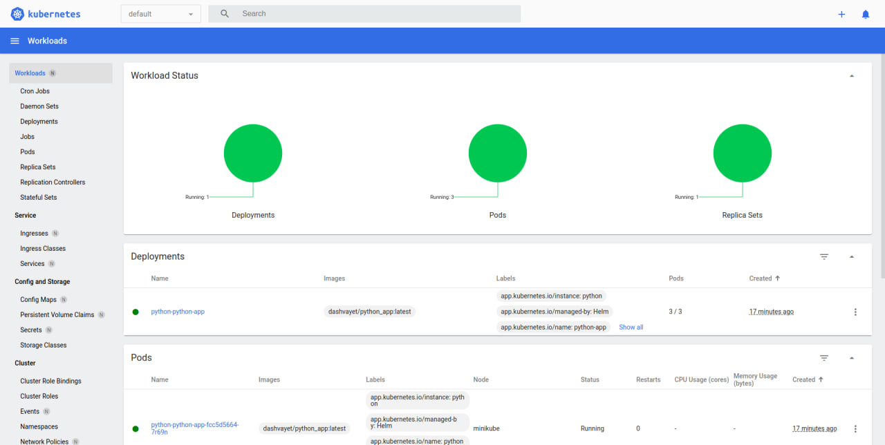

# Task 1
install dashboard:
``` 
helm install python . --values values.python.yml
```
```
NAME: python
LAST DEPLOYED: Tue Nov  7 19:36:42 2023
NAMESPACE: default
STATUS: deployed
REVISION: 1
NOTES:
1. Get the application URL by running these commands:
  http://python.timer.app/
```
## access application
```
 minikube service python-python-app
```
```
|-----------|-------------------|-------------|---------------------------|
| NAMESPACE |       NAME        | TARGET PORT |            URL            |
|-----------|-------------------|-------------|---------------------------|
| default   | python-python-app | http/5000   | http://192.168.49.2:30833 |
|-----------|-------------------|-------------|---------------------------|
🎉  Opening service default/python-python-app in default browser...
```


## Check application
```
kubectl get pods,svc
```
```
NAME                                    READY   STATUS    RESTARTS   AGE
pod/python-python-app-fcc5d5664-7r69n   1/1     Running   0          13m
pod/python-python-app-fcc5d5664-d8zg5   1/1     Running   0          13m
pod/python-python-app-fcc5d5664-jdpjt   1/1     Running   0          13m

NAME                        TYPE           CLUSTER-IP      EXTERNAL-IP     PORT(S)          AGE
service/kubernetes          ClusterIP      10.96.0.1       <none>          443/TCP          23m
service/python-python-app   LoadBalancer   10.108.115.52   10.108.115.52   5000:30833/TCP   13m
```

# Task 2 
1. lint 
```
helm lint python-app
```
```
==> Linting python-app
[INFO] Chart.yaml: icon is recommended

1 chart(s) linted, 0 chart(s) failed
```
2. install with dry-run
```
 helm install --dry-run helm-hooks python-app
NAME: helm-hooks
LAST DEPLOYED: Tue Nov  7 20:49:35 2023
NAMESPACE: default
STATUS: pending-install
REVISION: 1
HOOKS:
---
# Source: python-app/templates/post-install-hook.yaml
apiVersion: v1
kind: Pod
metadata:
   name: postinstall-hook
   annotations:
       "helm.sh/hook": "post-install"
spec:
  containers:
  - name: post-install-container
    image: busybox
    imagePullPolicy: Always
    command: ['sh', '-c', 'echo The post-install hook is running && sleep 15' ]
  restartPolicy: Never
  terminationGracePeriodSeconds: 0
---
...
NOTES:
1. Get the application URL by running these commands:
  export POD_NAME=$(kubectl get pods --namespace default -l "app.kubernetes.io/name=python-app,app.kubernetes.io/instance=helm-hooks" -o jsonpath="{.items[0].metadata.name}")
  export CONTAINER_PORT=$(kubectl get pod --namespace default $POD_NAME -o jsonpath="{.spec.containers[0].ports[0].containerPort}")
  echo "Visit http://127.0.0.1:8080 to use your application"
  kubectl --namespace default port-forward $POD_NAME 8080:$CONTAINER_PORT
```
3. install hooks
```
helm install helm-hooks ./python-app
```
```
NAME: helm-hooks
LAST DEPLOYED: Tue Nov  7 21:09:49 2023
NAMESPACE: default
STATUS: deployed
REVISION: 1
NOTES:
1. Get the application URL by running these commands:
  export POD_NAME=$(kubectl get pods --namespace default -l "app.kubernetes.io/name=python-app,app.kubernetes.io/instance=helm-hooks" -o jsonpath="{.items[0].metadata.name}")
  export CONTAINER_PORT=$(kubectl get pod --namespace default $POD_NAME -o jsonpath="{.spec.containers[0].ports[0].containerPort}")
  echo "Visit http://127.0.0.1:8080 to use your application"
  kubectl --namespace default port-forward $POD_NAME 8080:$CONTAINER_PORT
```
4. results
```
kubectl get po
```
```
NAME                                    READY   STATUS      RESTARTS   AGE
helm-hooks-python-app-864679bc9-zvrzj   1/1     Running     0          83s
postinstall-hook                        0/1     Completed   0          83s
preinstall-hook                         0/1     Completed   0          106s
```
As we can see - hooks are completed, so we achieve desired results
5. delete policy
Provided policy is enough
 ``` 
"helm.sh/hook-delete-policy": hook-succeeded
```
# Bonus task
## Extending for app_cpp
### Istall
```
helm install cpp ./python-app/ --values python-app/values.cpp.yml
```
```
NAME: cpp
LAST DEPLOYED: Tue Nov  7 21:30:24 2023
NAMESPACE: default
STATUS: deployed
REVISION: 1
NOTES:
1. Get the application URL by running these commands:
  http://guess.game.cpp.app/
```
### Check
```
kubectl get pods,svc
```

```
NAME                                    READY   STATUS    RESTARTS      AGE
pod/cpp-python-app-6fb64b6bd6-2jmhx     0/1     Running   1 (57s ago)   118s
pod/cpp-python-app-6fb64b6bd6-75f24     0/1     Running   1 (57s ago)   118s
pod/cpp-python-app-6fb64b6bd6-t4qmb     0/1     Running   1 (57s ago)   118s
pod/python-python-app-fcc5d5664-fhwgj   1/1     Running   0             28s
pod/python-python-app-fcc5d5664-n48mk   1/1     Running   0             28s
pod/python-python-app-fcc5d5664-w2n4t   1/1     Running   0             28s

NAME                        TYPE           CLUSTER-IP      EXTERNAL-IP     PORT(S)          AGE
service/cpp-python-app      LoadBalancer   10.99.229.94    10.99.229.94    5000:32433/TCP   118s
service/kubernetes          ClusterIP      10.96.0.1       <none>          443/TCP          125m
service/python-python-app   LoadBalancer   10.103.27.251   10.103.27.251   5000:31901/TCP   28s
```
```minikube service --all```
```
|-----------|----------------|-------------|---------------------------|
| NAMESPACE |      NAME      | TARGET PORT |            URL            |
|-----------|----------------|-------------|---------------------------|
| default   | cpp-python-app | http/10000  | http://192.168.49.2:32722 |
|-----------|----------------|-------------|---------------------------|
|-----------|------------|-------------|--------------|
| NAMESPACE |    NAME    | TARGET PORT |     URL      |
|-----------|------------|-------------|--------------|
| default   | kubernetes |             | No node port |
|-----------|------------|-------------|--------------|
😿  service default/kubernetes has no node port
|-----------|-------------------|-------------|---------------------------|
| NAMESPACE |       NAME        | TARGET PORT |            URL            |
|-----------|-------------------|-------------|---------------------------|
| default   | python-python-app | http/5000   | http://192.168.49.2:31901 |
|-----------|-------------------|-------------|---------------------------|
🎉  Opening service default/cpp-python-app in default browser...
🎉  Opening service default/python-python-app in default browser...
ruslan@Elestrias:~/Downloads/devops/core-course-labs/k8s$ Opening in existing browser session.
```


## Chart library
### Completing task
1. I have created new chart
2. Remove all from template + values.yml
3. add to dependencies of application chart
4. update deps for chart
```
helm dependency update
```

```
Hang tight while we grab the latest from your chart repositories...
...Successfully got an update from the "bitnami" chart repository
Update Complete. ⎈Happy Helming!⎈
Saving 1 charts
Deleting outdated charts

```
5. Install chart with dependencies and add to ```labes:``` part in deployment script

### Results
As a result we starting to receive custom labels and ```kubectl describe po``` starts to return huge amount of data, so I mention only a part below
```
ruslan@Elestrias:~/Downloads/devops/core-course-labs/k8s/python-app$  kubectl describe po
Name:             cpp-python-app-7f6569d454-s8k9v
Namespace:        default
Priority:         0
Service Account:  cpp-python-app
Node:             minikube/192.168.49.2
Start Time:       Tue, 07 Nov 2023 22:38:47 +0300
Labels:           app.kubernetes.io/instance=cpp
                  app.kubernetes.io/managed-by=Helm
                  app.kubernetes.io/name=python-app
                  app.kubernetes.io/version=1.16.0
                  helm.sh/chart=python-app-0.1.0
                  pod-template-hash=7f6569d454
Annotations:      <none>
Status:           Running
IP:               10.244.0.70
IPs:
  IP:           10.244.0.70
Controlled By:  ReplicaSet/cpp-python-app-7f6569d454
Containers:
  python-app:
    Container ID:   docker://f41135a434e898e4cc1ee78374964ab8eb7480dd9a9fd50ce934a21cedb63bc8
    Image:          dashvayet/app_cplusplus:latest
    Image ID:       docker-pullable://dashvayet/app_cplusplus@sha256:7bb9894706d119b3ece605181ccb54a306fee4d6c2a6394a8453feab0e738ed7
    Port:           10000/TCP
    Host Port:      0/TCP
    State:          Running
      Started:      Tue, 07 Nov 2023 22:38:50 +0300
    Ready:          True
    Restart Count:  0
    Liveness:       http-get http://:http/ delay=0s timeout=1s period=10s #success=1 #failure=3
    Readiness:      http-get http://:http/ delay=0s timeout=1s period=10s #success=1 #failure=3
    Environment:    <none>
    Mounts:
      /var/run/secrets/kubernetes.io/serviceaccount from kube-api-access-g2k2g (ro)
Conditions:
  Type              Status
  Initialized       True 
  Ready             True 
  ContainersReady   True 
  PodScheduled      True 
Volumes:
  kube-api-access-g2k2g:
    Type:                    Projected (a volume that contains injected data from multiple sources)
    TokenExpirationSeconds:  3607
    ConfigMapName:           kube-root-ca.crt
    ConfigMapOptional:       <nil>
    DownwardAPI:             true
QoS Class:                   BestEffort
Node-Selectors:              <none>
Tolerations:                 node.kubernetes.io/not-ready:NoExecute op=Exists for 300s
                             node.kubernetes.io/unreachable:NoExecute op=Exists for 300s
Events:
  Type    Reason     Age   From               Message
  ----    ------     ----  ----               -------
  Normal  Scheduled  2m3s  default-scheduler  Successfully assigned default/cpp-python-app-7f6569d454-s8k9v to minikube
  Normal  Pulled     2m2s  kubelet            Container image "dashvayet/app_cplusplus:latest" already present on machine
  Normal  Created    2m1s  kubelet            Created container python-app
  Normal  Started    2m1s  kubelet            Started container python-app
```